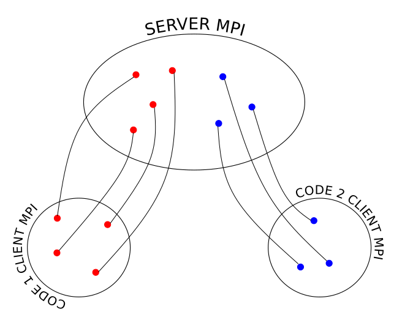

.. _client_server_cwipi:

Client-Server
#############

Client-Server CWIPI is a degenerate mode of the new version of CWIPI in terms of performance.
It has been developped to be able to do a coupling between parallel codes with a different version of MPI.
The API's of this mode and the new CWIPI version are broadly similar.

There is a Python interface for this mode. A Fortran might be developped upon request.

Example
=======

The aim is to couple *code 1* and *code 2*. The client-server mode is used because the MPI version of those codes is different.
Let *code 1* will be executing on 4 MPI ranks and *code 2* on 3 MPI ranks. As shown on the figure bellow, user written code is the **client**.
CWIPI itself will be running on the **server** side. That for each server nees to be launch on the same number of MPI ranks as its client counterpart.

If *code 1* sends an interpolated field to *code 2*, the client of *code 1* send an TCP-IP message to its server counterpart to opperate the field exchange.
At the same moment the client of *code 2* aks its server to retreive the field sent by *code 1*. The server of *code 2* will then send the field in a TCP-IP message to the client of *code 2*.

Server
======

This section will give some information on how to launch the server. Once CWIPI build with ``CWP_ENABLE_CLIENT_SERVER=ON``, in the ``bin`` folder
a executable file ``cwp_server`` is generated. This is the file that has to be launched to launch a server.
It is up to the user to choose the TCP port range on which the server will listen to the client (default 49100 to 49150) using ``-p``.
The code name for wich this server is lauched has to be given using ``-cn``.
This data is used by ``cwp_server`` to write a configuration file with the ``hostname/port``.
The client executables should be able to access this file. Indeed, it will read it to know on which server port to connect.
The path and name of this configuration file is set using ``-c``. Here is how the servers for the example above should be launched:

.. code:: bash

  mpiexec -n 4 ../bin/cwp_server -cn code1 -p 49100 49103 -c \"code1/cwp_config_srv.txt\" : -n 3  ../bin/cwp_server -cn code2 -p 49104 49106 -c \"code2/cwp_config_srv.txt\" &

Once the servers have been properly launched, the following message will be printed:

.. code:: bash

  ----------------------------------------------------------------------------
  All servers listening and cwipi config file created. You may connect clients
  ----------------------------------------------------------------------------

Client
======

This is the file that is writtent by the user with the functions in the ``src/new/client_server/client.h`` file.
The connection to the server is done in the ``CWP_client_Init`` function. The servers are shut down in ``CWP_client_Finalize``.
The client code needs to have access to the path to the cserver configuration file.
Once the above message is printed the client executable can be launched.

