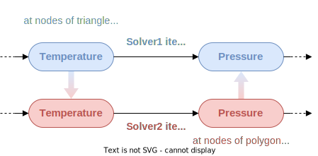

.. _concepts:

This section aims to underline the structure of a coupling set up in this new version of CWIPI.
The concepts will be detailed working with the following coupling scheme:

Coupling
--------

To set up the coupling between `Solver1` and `Solver2` one needs to create a Coupling instance to which general information such as the dimension of the coupling interface will be associated.

Mesh
----

Then the coupling interface needs to be specified (see :ref:`Define mesh`).
In this case, we set a 2D triangle and quadrangle mesh for `Solver1` and a polygon mesh for `Solver2`.
After setting the mesh coordinates, a so called block of the mesh elements should be added.
This means that in the mesh instance a block for the given type of elements will be added.
After creating this block, the mesh element data can be given using the add function for standard elements (``CWP_Mesh_interf_block_std_set`` in C) for `Solver1` and for polygons (``CWP_Mesh_interf_f_poly_block_set`` in C) for `Solver2`.

For CWIPI to be able to do the internal geometric computations on the mesh, it must be "finalized" (``CWP_Mesh_interf_finalize`` in C).

Fields
------

It is mandatory to define the interface mesh *before* creating field instances.
The degrees-of-freedom (dof) of a Field can either be located at mesh nodes, cell centers or a user-defined points.
There can be no more than one user-defined point cloud per Coupling object.

For `Solver1` a field instance for sending the temperature will be created and another instance for receiving the pressure.
For `Solver2` the opposite will be done.

Control Parameters
------------------

*à remplir*
