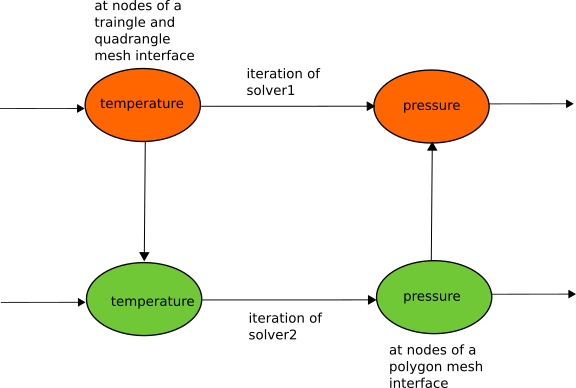

.. _concepts:

The aim of this section is to underline the structure of a coupling set up in this new version of CWIPI.
The concepts will be detailled working with the following coupling scheme:

Coupling
--------

To set up the coupling between `solver1` and `solver2` one needs to create a Coupling instance to which general information such as the dimension of the coupling interface will be associated.

Mesh
----

Then the coupling interface needs to be specified (see Define_mesh in :ref:`Old to New <old_to_new>`).
In this case, we set a 2D triangle and quadrangle mesh for `solver1` and a polygon mesh for `solver2`.
After setting the mesh coordinates, a so called block of the mesh elements should be added.
This means that in the mesh instance a section for the given type of elements will be added.
After creating this section, the mesh element data can be given using the add function for standard elements (`CWP_Mesh_interf_block_std_set` in C) for `solver1` and for polygons (`CWP_Mesh_interf_f_poly_block_set` in C) for `solver2`.
For CWIPI to be able to do the internal geometric computations on the mesh, it should be "finalized".

Fields
------

Defining the interface mesh is mandatory before creating field instances since the location of the field will be given relatively to the degrees of freedom of the mesh.
For `solver1` a field instance for sending the temparature will be created and another instance for receiving the pressure.
For `solver2` the opposite will be done.

