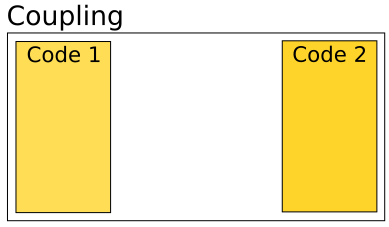
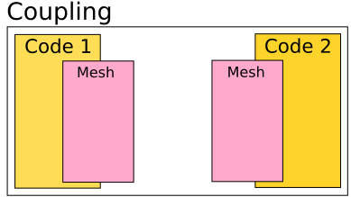
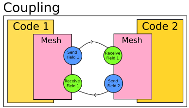

.. _old_to_new:

Old to New
##########

Version 1.x introduces major changes in the CWIPI library API compared to version 0.x.
This new version offers much more advanced features.
However, users should be able to easily reproduce their current applications with this new version.

In order to ease this transition, we focus here on the equivalence between the features of versions 0.x and 1.x.

Initialize and Finalize
=======================

All function calls are still framed by a call to the initialization and finalization functions.
Version 1.x supports multiple codes running on a single MPI rank.
Besides, one can select for each code which MPI ranks will be available for CWIPI.
Future versions will support time interpolation.
In anticipation for this feature, the initial time of each local code must be provided.

In summary, from version 1.x onwards the following additional arguments are required at CWIPI initialization:
   - ``n_code``: the number of codes executed on current MPI rank ;
   - ``code_names``: the list of local code names ;
   - ``is_active_rank``: this array indicates whether current MPI rank will participate in the coupling for each local code ;
   - ``time_init``: the array of initial times of local codes.

Create a coupling
=================

The key concepts used in CWIPI have been revisited in version 1.x.
Most importantly, the notion of *Field* as an object has been introduced (see section `Exchange fields`_).
The ``solver_type`` argument is now an attribute of the Field object.
Thus, a single Coupling object can now be used to exchange multiple fields with different degrees-of-freedom locations (mesh nodes, cell centers or user-defined target points).
All output-specfic arguments are now passed to ``CWP_Visu_set``.

On the other hand, some new arguments are now required.
First, as a coupling involves exactly two codes, the identifier of the local code involved in the coupling must be specified.
Next, since multiple spatial interpolation algorithms are now available, ``spatial_interp`` determines which one will be used for the coupling.
The specific properties for this algorithm (such as the geometric tolerance) are now defined via the function ``CWP_Spatial_interp_property_set``.
Since version 1.x supports multiple partitions (or subdomains) per MPI rank, ``n_part`` indicates the number of partitions of the coupling interface for the local code, on current MPI rank.
Finally, ``recv_freq_type`` will enable the user to choose a specific time interpolation scheme (not implemented yet).

The following table establishes the equivalence between the arguments that are essentially unchanged:

========================= =========================
**Version 0.x**           **Version 1.x**
========================= =========================
``coupling_name``         ``cpl_id``
``entitiesDim``           ``entities_dim``
``coupling_type``         ``comm_type``
``coupled_application``   ``coupled_code_name``
``mesh_type``             ``displacement``
========================= =========================

Exchange fields
================

The exchange of fields is no longer performed in one function call since this new API gives more flexibility.
The object-oriented aspect comes out more in this version.
The user creates a coupling between two codes each having a mesh on which several fields can be defined.
The non-blocking exchange functions were kept and are the way to go.

Summary
=======

