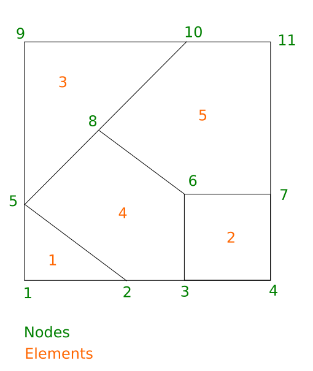
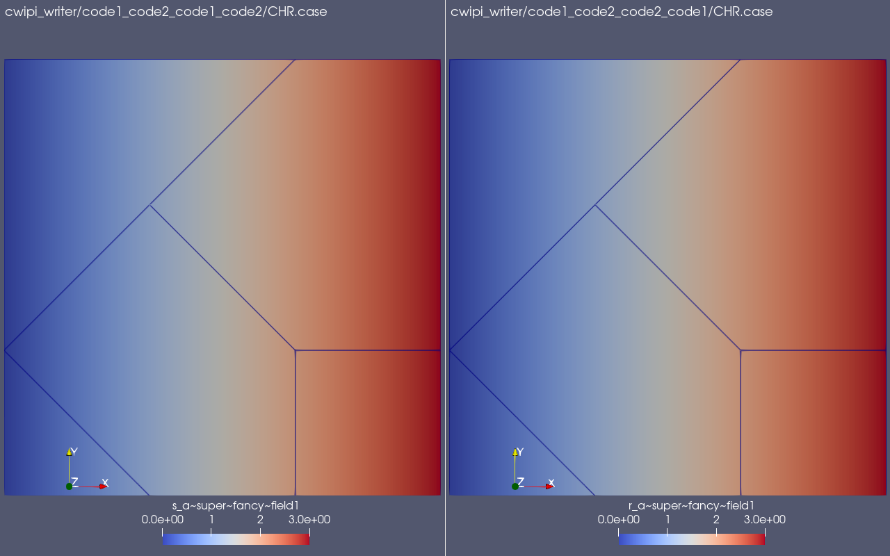

.. _quick_start:

Quick Start
###########

Here is shown how to couple two codes using the 1.x version of CWIPI in the different
programming languages in which CWIPI is available. Both codes have the same basic
polygonal mesh (see figure). code1 sends a field on the nodes to code2 and the unmapped points are checked.

CWIPI C
-------

Code
~~~~

.. literalinclude:: ../../../tests/tutorial/c_new_api_polygon_sol.c
   :language: c

The file path in the repository is ``<cwipi_source>/tests/tutorial/c_new_api_polygon_sol.c``.

Compilation
~~~~~~~~~~~

.. code-block:: sh

  export CWIPI_INSTALL_DIR=<path>/<where>/<cwipi>/<is>/<installed>
  mpicc -I$CWIPI_INSTALL_DIR/include -L$CWIPI_INSTALL_DIR/lib -o <exec> <file>.c -lcwp

Execution
~~~~~~~~~

.. code-block:: sh

  export LD_LIBRARY_PATH=$LD_LIBRARY_PATH:$CWIPI_INSTALL_DIR/lib/
  mpirun -np 2 ./<exec>

CWIPI Fortran
-------------

Code
~~~~

.. literalinclude:: ../../../tests/tutorial/fortran_new_api_polygon_sol.F90
   :language: fortran

The file path in the repository is ``<cwipi_source>/tests/tutorial/fortran_new_api_polygon_sol.F90``.
The ``cwipi_configf.h`` header necessary for compilation is automatically generated at build time when ``CWP_ENABLE_Fortran`` is set to ``ON``.

Compilation
~~~~~~~~~~~

.. code-block:: sh

  export CWIPI_INSTALL_DIR=<path>/<where>/<cwipi>/<is>/<installed>
  mpif90 -I$CWIPI_INSTALL_DIR/include -L$CWIPI_INSTALL_DIR/lib -o <exec> <file>.f90 -lcwpf -lcwp -cpp

Execution
~~~~~~~~~

.. code-block:: sh

  export LD_LIBRARY_PATH=$LD_LIBRARY_PATH:$CWIPI_INSTALL_DIR/lib/
  mpirun -np 2 ./<exec>

CWIPI Python
------------

Code
~~~~

.. literalinclude:: ../../../tests/tutorial/python_new_api_polygon_sol.py
   :language: python

The file path in the repository is ``<cwipi_source>/tests/tutorial/python_new_api_polygon_sol.py``.

Execution
~~~~~~~~~

.. code-block:: sh

  export CWIPI_INSTALL_DIR=<path>/<where>/<cwipi>/<is>/<installed>
  export PYTHONPATH=$CWIPI_INSTALL_DIR/lib/python<version>/site-packages:$PYTHONPATH
  mpirun -np 2 python <file>.py

Visualization
-------------

CWIPI will produce a ``cwipi_writer`` directory containing the output of the two codes:

- ``code1_code2_code1_code2`` (coupling ``code1_code2``, interface mesh for ``code1``, partitioning information for ``code1``, data sent to/received from ``code2``)
- ``code1_code2_code2_code1`` (coupling ``code1_code2``, interface mesh for ``code2``, partitioning information for ``code2``, data sent to/received from ``code1``)

The output files are in the Ensight Gold format. The ``.case`` files should be opened with, e.g., Ensight or ParaView to visualize the exchanged fields on the respective interface meshes.
For the examples above, the two fields ``s_a~super~fancy~field1`` (sent) and ``r_a~super~fancy~field1`` (received) can be visualized and will show the same values on the two interface meshes.

