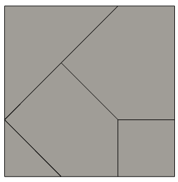
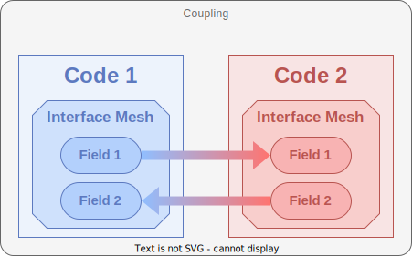
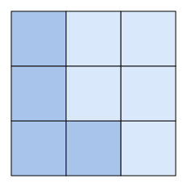
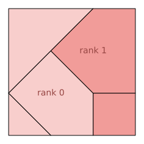
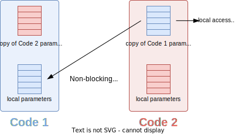

---
jupytext:
  text_representation:
    extension: '.md'
    format_name: myst
    format_version: '0.7'
    jupytext_version: 1.4.0+dev
kernelspec:
  display_name: Python 3
  language: python
  name: python3
---


# Introduction

Welcome to the **CWIPI** library introductory day !

The aim of the day is to give you : 
  - An overview of **CWIPI** 1.0 functionalities
  - An understanding on how **CWIPI** can be called to couple solvers written in C/C++, Fortran or Python.

This is an interactive course, so don't hesitate to interrupt us to ask your questions.

The training will take place in three stages:
  - General presentation of **CWIPI**
  - Exercise 0 : getting started with Jupyter Notebooks
  - Exercise 1 : a basic coupling
  - Exercise 2 : an extension on time step management with a deforming mesh


<!-- ===== DEBUT SLIDES F.DUCHAINE (CWIPI training 2022)
* En un mot, c'est quoi CWIPI: an open-source library for coupling scientific codes in a massively parallel distributed environment

* En un mot, pourquoi le couplage? : to achieve complex, multi-physics, multi-components simulations, ...

* Objectifs
* Motivation/choix de design (pourquoi pas approche monolithique, ...)
* Philosophie (les codes instrumentent CWIPI, pas de structure de donnée complexe, ...) (ici ou après historique?)
=====


* Historique de CWIPI, licence, contributeurs

* Exemples d'utilisation

* Où ça se trouve? (site web, GitLab, git externe)
* Comment ça s'installe -> README + lien doc

* Concepts fondamentaux
  * notion de maillage (comme PDM), préciser que CWIPI only deals with unstructured meshes
  * principe du couplage : les codes s'échangent des informations au niveau de l'interface entre leurs maillages respectifs
  -> CWIPI only deals with this interface, which can be of dimension 0, 1, 2 or 3.

  * exercice/jeu participatif
    But: introduire - les notions fondamentales (Coupling, Mesh, Field)
                    - les "features" (spatial interpolation, ctrl params, communicateurs MPI, TCP)
                    - les améliorations/nouveautés ont motivé la réécriture complète de CWIPI, d'où New API

    1. on pose le pb: on a veut coupler 2 codes => on crée un "environnement" de couplage (Coupling) (un Coupling fait toujours intervenir 2 codes (potentiellement des instances du même solveur), mais on peut avoir un nombre arbitraire de Couplings)
    2. on a dit que les codes devaient s'échanger des infos à travers une interface de couplage géométrique, discrétisée dans chaque code par une portion de son maillage => chaque code doit donc définir SA discrétisation (Interface Mesh) (pas de copie du maillage et si un code intervient dans plusieurs Couplings il peut avoir plusieurs Interface meshes)
    3. quelles sont les informations que les codes doivent s'échanger? Principalement des variables physiques (faire écho aux exemples d'utilisation?) (Field) (les dofs de ces Fields sont associés au Interface mesh et puisque on l'échange, la définition des Fields par les 2 codes couplés doit être cohérente)
    4. On a maintenant toutes les notions nécessaires pour commencer à esquisser le pseudo-code d'un cas de couplage basique : code1 envoie un champ F1 à code2(, code2 envoie un champ F2 à code1)
      -> les participants doivent obtenir un truc du genre:
          0 - (Init CWIPI)
          1 - Create a Coupling envrionment
          2 - Each code describes its Interface mesh
          3 - Definition of Field F1
          4 - code1 sends F1
          5 - code2 receives F1
          (6 - code2 sends F2
           7 - code1 receives F2)
          (8 - repeat 4 to 7 over N iterations)
          9 - Finalize CWIPI
    5. Ok mais en général les Interface meshes de code1 et code2 ne match pas => Spatial interpolation -> méthodes, PDM, perfo, user-defined interpolation
      -> voir comment ça s'insère dans le pseudo-code
    6. Ok on sait faire un ping-pong basique mais en pratique les applications nécessitent des schémas de couplages bien plus complexes (fig. JDG) => les codes doivent pouvoir communiquer autre chose que des champs, ils doivent partager les paramètres qui définissent le schéma de couplage => Control Parameters -> old/new
      -> voir comment ça s'insère dans le pseudo-code
    7. comms (dis)joints (script Python qui instrumente les deux codes)
    8. contraintes MPI (codes commerciaux, ...) => alternative client-serveur TCP/IP
    9. => Réécriture complète, nouvelle API, documentation upgrade 0.x -> 1.0

*** Il faut intercaler le "Behind the scenes" (parallèle massif caché, comms p2p avec illustration des partitions qui se recouvrent)
     -->


## What is CWIPI ?

#### LGPL code coupling library in a massively parallel distributed setting:
- Provides tools to define code coupling algorithms to control each exchange between the codes
- Transfer of interpolated fields through a geometric coupling interface

#### Version 0.x:
- since 2009
- dependency to FVM (LGPL, EDF R&D)

#### Version 1.0:
- released in 2023
- dependency to ParaDiGM (LPGL, ONERA)

#### Contributors:
- ONERA: equivalent of one full-time developer (4 physical persons)
- CERFACS: post-doctoral researchers

#### Access
- https://gitlab.onera.net/numerics/coupling/cwipi (ONERA users only)
- https://w3.onera.fr/cwipi/bibliotheque-couplage-cwipi (in French)
- on GitHub (in progress)

#### Documentation
- https://numerics.gitlab-pages.onera.net/coupling/cwipi/dev/index.html

# Installation instructions

Follow these steps to build **CWIPI** from the sources:

1. `git clone git@gitlab.onera.net:numerics/coupling/cwipi.git` (ONERA users only)
1. `cd cwipi`
1. `git submodule update --init` (needed for dependencies)
1. `mkdir build`
1. `cd build`
1. `cmake ..`
1. `make`
1. `make install`
1. `./cwp_run` (if you want to run the test cases)

## CMake options

Note that you should add `-D` before your option in the compile command. Like this:
`cmake -D<option1_name>=<option1_value> ... -D<option2_name>=<option2_value>`

Let's have a look at the different install options:
- **CMAKE_INSTALL_PREFIX**=<prefix> : installation prefix
- **CWP_ENABLE_Fortran**=<ON | OFF> (default : OFF) : enable Fortran interface
- **CWP_ENABLE_PYTHON_BINDINGS**=<ON | OFF> (default : OFF) : enable Python interface

*Remark: If autodetection fails, you can use `PYTHON_LIBRARY=<path>` and `PYTHON_INCLUDE_DIR=<path>` options to find Python.
Refer to [FindPython](https://cmake.org/cmake/help/latest/module/FindPython.html) in the CMake documentation for more information.*

- **CWP_ENABLE_SHARED**=<ON | OFF> (default : ON) : build shared library
- **CWP_ENABLE_STATIC**=<ON | OFF> (default : ON) : build static library
- **CWP_ENABLE_BLAS**=<ON | OFF> (default : ON) : enable the use of [BLAS](https://www.netlib.org/blas/) (linear algebra)

*Remark : If a simple autodetection fails, ou can use `BLAS_DIR=<path>` (where to find the base directory of BLAS), `BLAS_INCDIR=<path>` (where to find the header files) and `BLAS_LIBDIR=<path>` (where to find the library files) options to find BLAS.
To force the use of a list of libraries, use `DBLAS_LIBRARIES="<lib_1> ... <lib_n>"`.*

- **CWP_ENABLE_CLIENT_SERVER**=<ON | OFF> (default : OFF) : enable client-server mode
- **CWP_ENABLE_DOCUMENTATION**=<ON | OFF> (default : OFF) : enable documentation mode
- **CWP_ENABLE_EXTERNAL_PDM**=<ON | OFF> (default : OFF) : enable use of external ParaDiGM

*Remark: use `PDM_ROOT=<path>` to specify the path to external ParaDiGM install.*

## Compiler choice

    CC=<C compiler> CXX=<CXX compiler> FC=<Fortran compiler> cmake ...

or use the following CMake options

    CMAKE_C_COMPILER=<C compiler>
    CMAKE_CXX_COMPILER=<CXX compiler>
    CMAKE_Fortran_COMPILER=<Fortran compiler>

## CMake MPI options

    MPI_C_COMPILER=<C MPI wrapper>
    MPI_CXX_COMPILER=<CXX MPI wrapper>
    MPI_Fortran_COMPILER=<Fortran MPI wrapper>

If a simple autodetection fails, you can use these options to find MPI :

    MPI_<language>_LIBRARIES
    MPI_<language>_INCLUDE_PATH

Refer to [FindMPI](https://cmake.org/cmake/help/latest/module/FindMPI.html) in the CMake documentation for more information.

# Examples of uses

## At ONERA

### Noise prediction at launcher lift-off

- Coupled codes : CEDRE (aerodynamic near-field, Finite Volume (FV) method) - SPACE (acoustic far-field, Discontinuous Galerkin method)
- *Surface* coupling interface
- Contributors : A. Langenais, F. Vuillot, C. Peyret, G. Chaineray, C. Bailly


### Modeling high-altitude jets

- Coupled codes : CEDRE (dense jet, FV method) - SPARTA (rarefied gas, Direct Simulation Monte Carlo)
- *Surface* coupling interface
- Contributors : <span style="color:red">??????</span>


### Plasma in a flow

- Coupled codes : CEDRE (CFD, FV method) - TARANIS (plasma, <span style="color:red">method?</span>)
- *Volume* coupling interface
- Contributors : A. Bourlet, F. Tholin, A. Vincent, J. Labaune


### Thermal degradation of composite materials

- Coupled codes : CEDRE (convection, FV method) - TARANIS (plasma, <span style="color:red">method?</span>) - MODETHEC (?)
- *Surface* and *volume* coupling interface
- Contributors : X. Lamboley, B.Khiar


## Elsewhere

### 360-degrees Large-Eddy Simulation of a full engine

- Coupled codes : AVBP - AVBP (FV method)
- *Volume* coupling interface
- Contributors : C. Pérez Arroyo, J. Dombard, F. Duchaine,L. Gicquel, B. Martin, N. Odier, G. Staffelbach


### Fluid - Structure interaction

- Coupled codes : Yales2 - Yales2 (FV method)
- *Surface* coupling interface
- Contributors : T. Fabbri, G. Balarac, P. Bénard, V. Moureau


# Core concepts

Before starting the hands-on exercise, we will spend some time on the philosophy to build a coupling using the CWIPI library. To do so, we will work with the following basic coupling example:

## A basic coupling

Let `code 1` and `code 2` be two solvers. We want to send a field of `code 1` defined on the nodes of the associated mesh to `code 2`. Let the coupling interface for `code 1` be:


and for `code 2` be:



As you can see, the meshes do not have to be coincident in order to couple using **CWIPI**.

### Coupling definition

As seen in the text above, to define a coupling one has first to tell which codes are going to communicate together.
 In our case of this basic coupling, that gives us:


### Coupling interface

If we want to couple those two solvers, it means that there is an area in which the physical phenomenon of `code 2` acts on `code 1` and vise versa.
In this area of the mesh, the numerical scheme takes account of the influence of the physical phenomenon of the coupled code.
It is this portion of the mesh that we call coupling interface. Thus for each code participating in the coupling, we need to define this mesh portion:


In version 0.x a single function ``cwipi_define_mesh`` was used to define the mesh in an element$\to$vertex fashion.
Version 1.x, gives more flexibility in the way the mesh is provided so several functions must be called to define the mesh.
In any case, you proceed the same way to define the mesh vertex coordinates. An example code in C is given below.

#### Mesh vertices coordinates

The coordinates of the mesh vertices should be provided in the following way:

```{prf:algorithm} c
  CWP_Mesh_interf_vtx_set("code_name",
                          "coupling_name",
                          partition_identifier,
                          number_of_vertices,
                          coordinates,
                          NULL);
```

The different ways to provide the mesh to CWIPI are explained below with C code. Note that all functions with the ``partition_identifier``
argument must be called for all partitions on the given MPI rank.

#### Polygonal/Polyhedral Mesh

This way of defining the mesh is the most similar to the way the mesh where defined in version 0.x.
If you want to provide a polygonal (2D) mesh in an element$\to$vertex fashion, you should do:

```{prf:algorithm} c
  int block_idendifier = CWP_Mesh_interf_block_add("code_name",
                                                   "coupling_name",
                                                   polygonal_block_type);

  CWP_Mesh_interf_f_poly_block_set("code_name",
                                   "coupling_name",
                                   partition_identifier,
                                   block_idendifier,
                                   number_of_faces,
                                   face_vertex_index,
                                   face_vertex_connectivity,
                                   NULL);
```

If you want to provide a polyhedral (3D) mesh in an element$\to$vertex fashion, you should do:

```{prf:algorithm} c
  int block_idendifier = CWP_Mesh_interf_block_add("code_name",
                                                   "coupling_name",
                                                   polyhedral_block_type);

  CWP_Mesh_interf_c_poly_block_set("code_name",
                                   "coupling_name",
                                   partition_identifier,
                                   block_idendifier,
                                   number_of_cells,
                                   face_edge_index,
                                   face_edge_connectivity,
                                   cell_vertex_index,
                                   cell_vertex_connectivity,
                                   NULL);
```

#### Standard element Mesh

If you want to provide your mesh per standard element type (eg for Finite Element codes) but still in element$\to$vertex fashion, you should do for each element type:

```{prf:algorithm} c
  int block_idendifier = CWP_Mesh_interf_block_add("code_name",
                                                   "coupling_name",
                                                   standard_block_type);

  CWP_Mesh_interf_block_std_set("code_name",
                                "coupling_name",
                                partition_identifier,
                                block_idendifier,
                                number_of_elements,
                                element_vertex_connectivity,
                                NULL);
```

#### Standard high-order element Mesh

CWIPI is compatible with the use of meshes with high order elements for the localization algorithm.


Since the order of the vertices in the element is different depending on chosen standard, in CWIPI you can provide your own ordering.
It is the same logic as for a standard element, only you need to use the high-order specific functions as you can see bellow:

```{prf:algorithm} c
  int block_idendifier = CWP_Mesh_interf_block_add("code_name",
                                                   "coupling_name",
                                                   high_order_standard_block_type);

  CWP_Mesh_interf_block_ho_set("code_name",
                               "coupling_name",
                               partition_identifier,
                               block_idendifier,
                               number_of_elements,
                               order,
                               element_vertex_connectivity,
                               NULL);

   CWP_Mesh_interf_ho_ordering_from_IJK_set("code_name",
                                            "coupling_name",
                                            high_order_standard_block_type,
                                            order,
                                            number_of_vertices_per_element,
                                            high_element_vertex_ordering_per_element);
```

#### Downward topological connections Mesh

By downward topological connection we mean in 3D cell$\to$face and face$\to$vtx and face$\to$edge plus edge$\to$vtx in 2D.

If you want to provide a polygonal (2D) mesh in a downward topological connection fashion (eg for Finite Volume codes), you should do:

```{prf:algorithm} c
  CWP_Mesh_interf_from_faceedge_set("code_name",
                                    "coupling_name",
                                    partition_identifier,
                                    number_of_faces,
                                    face_edge_index,
                                    face_edge_connectivity,
                                    number_of_edges,
                                    edge_vertex_connectivity,
                                    NULL);
```

If you want to provide a polyhedral (3D) mesh in a downward topological connection fashion, you should do:

```{prf:algorithm} c
  CWP_Mesh_interf_from_cellface_set("code_name",
                                    "coupling_name",
                                    partition_identifier,
                                    number_of_cells,
                                    cell_face_index,
                                    cell_face_connectivity,
                                    number_of_faces,
                                    face_vertex_index,
                                    face_vertex_connectivity,
                                    NULL);
```

### Field definition

The point of the whole coupling is to let the physical phenomenon in the common area interact.
This means that the field describing the phenomenon in `code 1` has to be shared with `code 2` (and vise versa but in this basic example we leave that aside).
Each solver has its own numerical method, thus location of the field (cell centered, node centered or other) on its mesh.
To set what will be exchanged we define for each code its fields. Here `code 1` will send a field to `code 2` and `code 2` will create a buffer to receive what `code 1` sends it (again, and vise versa).
This leaves us with:



### Behind the scenes

We have highlighted the fact that CWIPI has been developed for coupling in a massively parallel environment.
What about parallelism in this set-up? The key point in the development of CWIPI is the transparency of parallelism to the user. That's why you can't see it!


| Code 1 partitioning  | ?   |  Code 2 partitioning |
|:--------------------:|:---:|:--------------------:|
|  |  |  |

The figure above illustrates the construction of the point-to-point communication graph between the processes of the two coupled codes and
the fact that the interpolated field are exchanged through direct MPI messages.

# CWIPI 1.x

This leads us to talk about the version of CWIPI this training focuses on : 1.0.
For those who have worked with the previous version of CWIPI, you will be able to see how your requests have been taken into account.
For those new to CWIPI, this section allows you to discover the special features of this version.

## Client-Server mode

In the previous section, we highlighted the fact that performance comes from the use of point-to-point communications.
To answer the request of using CWIPI with commercial codes (Fluent, MARC, NASTRAN, etc.) with fixed integrated MPI, we developed a client-server mode of CWIPI relying on TCP/IP exchanges.
Those are done between codes with their specific MPI (client) and a common MPI environment on which CWIPI runs (server).
This is based on work done by CERFACS for the OpenPALM client/server mode.
Obviously, this degrades the performance but it increases flexibility.


## Distribution of code ranks

- Mode 1: Disjoint code MPI communicators (CWIPI-0.x mode)


In the following modes, the coupled codes run (partially of totally) on the same MPI ranks.

- Mode 2: Sharing MPI ranks between codes


- Mode 3: Sharing of all MPI ranks


This last mode can be used, for instance, in Python when both codes are imported in the same script and they will then run on the same MPI ranks.

## Non-blocking control parameters

Control parameters are variables defined by each code available to the coupled code.
This comes handy when you need to implement a complicated coupling scheme. Here are a few examples of coupling schemes provides by Jean-Didier Garaud.


Using CWIPI 0.x this was tricky since the was a synchronization point before being able to get the parameters value.


This drawback has been removed in the version we work with using one-sided communications.



## User spatial interpolation function

Talking about more complicated coupling schemes, a handy feature is the callbacks.
Those are a way to provide to CWIPI your own local spatial interpolation function.
CWIPI will still do all the parallel work, you will only have to specify the local data processing.

The pattern to write those functions is available [here](https://numerics.gitlab-pages.onera.net/coupling/cwipi/dev/new_cwipi/new_cwipi.html#user-defined-spatial-interpolation).
Note that it has been simplified compared to CWIPI 0.x because instead of a long list of arguments you will only call the getters you need within the function.

## Spatial interpolation methods

### New methods...

<!-- CWIPI 0.x features a single spatial interpolation method, based on the location of the target degrees-of-freedom (dofs) in the source mesh. -->
The table below lists the available families of [spatial interpolation methods](https://numerics.gitlab-pages.onera.net/coupling/cwipi/dev/new_cwipi/new_cwipi.html#spatial-interpolation-methods), along with the admissible dof locations:

<!--  -->

| Method            | Source field dofs                        | Target field dofs                        |
|:-----------------:|:----------------------------------------:|:----------------------------------------:|
| *Nearest neighbors* | nodes <br> cell centers <br> user-defined points | nodes <br> cell centers <br> user-defined points |
| *Intersection*      | <span style="color:gray">nodes</span> <br> cell centers | <span style="color:gray">nodes</span> <br> cell centers |
| *Location*          | nodes <br> cell centers | nodes <br> cell centers <br> user-defined points |

### ... which rely on ParaDiGM ...

Those methods rely on algorithms written in the **ParaDiGM** library, which is the new geometric core of CWIPI.
On the figure below you can see how ParaDiGM features can be integrated in a solver workflow further than just for coupling.


### ... lead to performance

CWIPI 0.x used the localization algorithm, which is still available in CWIPI 1.x.

This algorithm has, though, been completely rewritten. Let us focus on the example bellow to explain the difference :


The red and blue squares are coupling interfaces of two different codes which are partitioned in different ways.
Each partition being on a different MPI rank, there are thus little processors that have a part of the mesh which is involved in the coupling.

The localization algorithm in 0.x had a parallel context but was multi-sequential.
That means that the sequential localization algorithm was run on each MPI rank using the initial mesh partitioning.
Thus no load balancing. On the figure bellow you can see that for our example (in the gray ellipse zone) the performance is poor compared the the algorithm in 1.x. Why?


The localization algorithm in 0.x has a parallel context but is also parallel.
Now, the workload generated by the overlapping region is dispatched over all available MPI ranks. This actually defines load balancing !

## A new API

To integrate all these new features and use ParaDiGM as a geometric core, the library has been completely rewritten, which means changing the API.
For users of the previous version of CWIPI, you will probably have recognized the general philosophy you already know during the presentation of the core concepts.
We started a documentation on how to port your coupling with CWIPI 0.x to 1.x. Feel free to suggest changes to improve it !


# Pseudo-code coupling algorithm

Let's go back to the basic coupling described earlier, reads in pseudo-code as:

```{prf:algorithm} basic coupling algorithm

**Inputs** Given $code1$ with a mesh $m1$ on which a field that will be sent is defined $sf1$. Given $code2$ with a mesh $m2$ on which a field that will be received is defined $rf2$.

**Output** $rf2$, which is $sf1$ interpolated on $m2$

1. Initialize CWIPI
2. Set coupling between $code1$ and $code2$
3. Describe codes:
   1. $code1$ has a mesh $m1$ on which we define a field $sf1$
   2. $code2$ has a mesh $m2$ and a receive buffer field $rf2$
4. Operate solver iterations:
   1. $code1$ sends $sf1$
   2. $code2$ receives $rf2$
5. Finalize CWIPI
```

In exercise 1, we will focus on implementing this basic coupling.
In exercise 2, we will adapt that code for a coupling interface mesh that is deformed over time.

But first, let's introduce the code notebooks by moving on to [Exercise 0](./exercice_0.ipynb).

+++

#### Basic coupling algorithm
**Inputs** Given `code1` with a mesh `m1` on which a field that will be sent is defined `sf1`. Given `code2` with a mesh `m2` on which a field that will be received is defined `rf2`.

**Output** `rf2`, which is `sf1` interpolated on `m2`

1. Initialize CWIPI
2. Set coupling between `code1` and `code2`
3. Describe codes:
   1. `code1` has a mesh `m1` on which we define a field `sf1`
   2. `code2` has a mesh `m2` and a receive buffer field `rf2`
4. Operate solver iterations:
   1. `code1` sends `sf1`
   2. `code2` receives `rf2`
5. Finalize CWIPI
